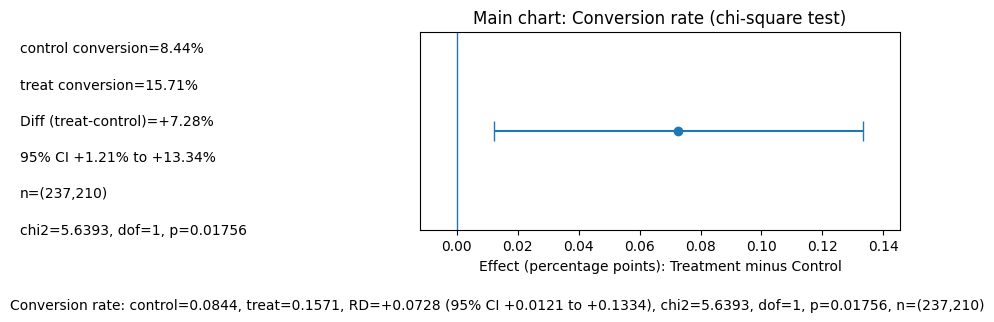
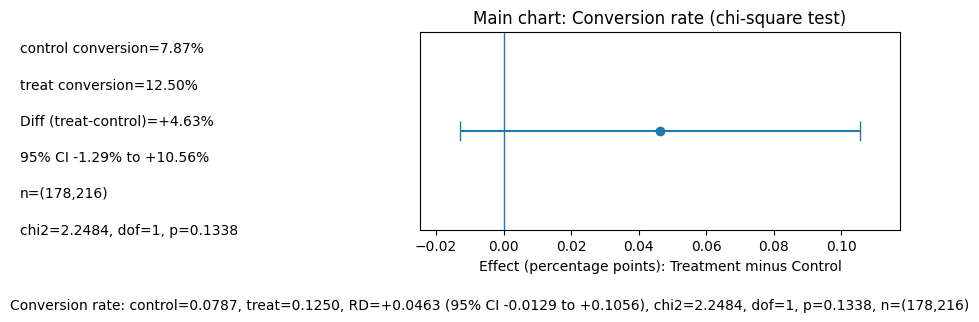
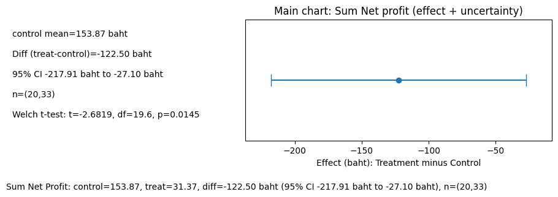
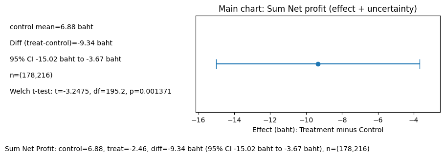

# Promotion Effect Analysis — 15% Discount Campaign A/B Test

Statistical evaluation of a 15% discount campaign's effect on conversion rate, sales, and profit across North and South regions, using hypothesis testing and confidence intervals in Python — Data Analytics Bootcamp (Sprint 3).

## Business Problem

- The business ran a 15% discount campaign in January 2025 and wants to know whether it actually worked — and whether the effect differs by region (Heterogeneous Effect).
- A campaign that lifts conversion rate but quietly erodes profit is a bad trade; the analysis needs to look past the headline metric to see the full picture.

## Hypothesis

- **Business Question:** Does the 15% discount campaign affect Conversion Rate differently between the North and South regions, comparing Treatment vs. Control in January 2025?
- **Analytical Questions:** average Conversion Rate, Order Count, and Net Profit for Treated vs. Control customers, by region; whether Sale Amount relates to overall Net Profit.

## Data & Tools

- **Tools:** Python (pandas, scipy — chi-square test, Welch's t-test, confidence intervals)
- **Data:** Customer-level records for North and South regions, January 2025, with `conversion_flag`, `region`, `orders_cnt`, `sales_amount`, and `net_profit`
- **Experiment design:** Treatment vs. Control, evaluated over a 30-day window, with a 3-tier metric framework:
  - **Primary:** Conversion Rate
  - **Supporting:** Avg Order Count
  - **Guardrail:** Avg Sales Amount, Avg Net Profit

## Approach

1. Framed the business question into testable analytical questions and mapped each to a metric definition (unit of analysis: customer, filtered by region and campaign group)
2. Ran descriptive checks and distribution analysis before testing — both `sales_amount` and `net_profit` were zero-heavy and right-skewed, so mean-based comparisons were interpreted with care
3. Tested the primary metric (Conversion Rate) with a chi-square test and 95% confidence interval on the risk difference, separately for North and South
4. Checked supporting and guardrail metrics with Welch's t-test, to catch trade-offs the primary metric alone would miss
5. Synthesized results into a decision framework (Decision / Trigger / Action) rather than stopping at "statistically significant or not"

## Key Insight

| Region | Metric | Control | Treatment | Effect | 95% CI | Significant? |
|---|---|---|---|---|---|---|
| North | Conversion Rate (Primary) | 8.44% | 15.71% | +7.28 pp | +1.21 to +13.34 pp | Yes |
| North | Sum Net Profit (Guardrail) | ฿153.87 | ฿31.37 | -฿122.50 | -฿217.91 to -฿27.10 | Yes (worse) |
| South | Conversion Rate (Primary) | 7.87% | 12.50% | +4.63 pp | -1.29 to +10.56 pp | No |
| South | Sum Net Profit (Guardrail) | ฿6.88 | -฿2.46 | -฿9.34 | -฿15.02 to -฿3.67 | Yes (worse) |

**North — Conversion Rate (Primary metric)**

**South — Conversion Rate (Primary metric)**

- The campaign lifted conversion rate in both regions (+86% relative uplift in North, +59% in South), but the North effect was statistically significant while the South effect was not (CI crosses 0).

**North — Net Profit (Guardrail)**

**South — Net Profit (Guardrail)**

- **The guardrail metric tells the real story:** Net Profit dropped significantly in both regions — in North, treated customers generated ฿122.50 less profit on average than control, despite converting more (Welch's t-test, p = 0.0145). South showed the same pattern (p = 0.0014).

## Decision

**HOLD.** A conversion-rate win that comes with a statistically significant profit decline is not a pass — the campaign should not be rolled out as-is.
**Recommended action:** pause rollout and investigate promotion design (e.g., adjusting discount depth or moving to targeted promotions) before re-testing.

## Limitations

- Order Count, Sales Amount, and Net Profit are 0 for non-converting customers, which affects how the averages should be read
- Sample size may be insufficient given the gap between Treatment's higher conversion rate and the resulting uncertainty in guardrail estimates
- The 30-day test window can't capture longer-term effects on customer lifetime value
- No root-cause analysis yet on why profit declined (discount cost vs. shifted purchase behavior)
- Findings are specific to the North and South regions tested and may not generalize to other regions

## Links

- [Analysis notebook — North](https://colab.research.google.com/drive/1wcD2h5eX9vLmPBo4A3uOpyiYU6x53IjH?usp=sharing)
- [Analysis notebook — South](https://colab.research.google.com/drive/1ZWG-7uuF2Vd8DyL7HkOH6qUJMQZwGfh0?usp=sharing)
